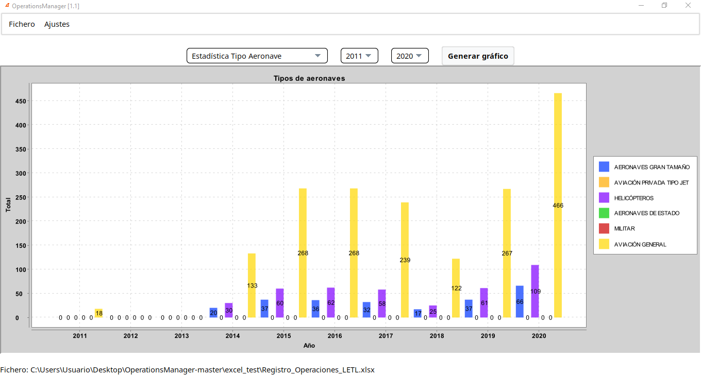

# OperationsManager ℹ️
OperationsManager es un software que pretende automatizar la generación de distintas estadísticas de las operaciones
del aeropuerto de Teruel (PLATA)

## Contexto y estado 💡
Este proyecto fue realizado durante mis prácticas universitarias en PLATA
```diff
- [Finalizado]
```

## Requerimientos 🔏
* Versión 14.0.1 de java

## Development Setup 🔬
```bash
mvn clean compile -Pdev
```

## Production Setup 🔨
```bash
mvn clean package -Pprod
java -jar target/OperationsManager-VERSION-jar-with-dependencies.jar
```

## Versiones 📁
* v0.1 -> Generación básica de los distintos gráficos estadísticos
* v1.0 -> Refractorización y mejoras en la generación de gráficos
* v1.1 -> Añadidos nuevos gráficos

